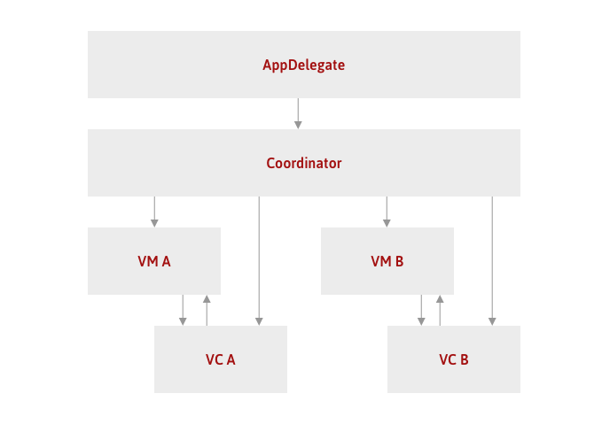
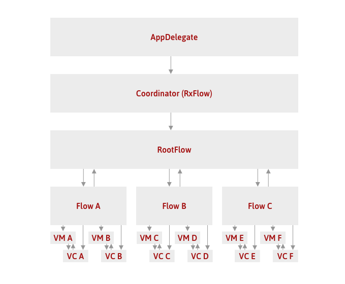

import { Head } from 'mdx-deck'
import { Split } from 'mdx-deck/layouts'
export { default as theme } from './theme'

<Head>
  <title>Navigation as Code</title>
</Head>

## From Interface Builder
## to Navigation as Code.

---

## Agenda
* Storyboards
* Rationale
* Coordinator pattern
* RxFlow
* Takeaways

---

## Storyboards

Hands-on!

---

## Storyboards
### Painpoints
* Very slow slow Xcode (Interface Builder)
* Storyboard References
* Navigation flow hard to follow
* Dependency injection / Additional properties
* Still need boilerplate code
* Merge conflicts or diffing is hard

---

## Storyboards

Dozens of articles on medium on how to get rid of Storyboards.

---

## Rationale
### X as Code

X as code (XaC) is the process of configuring an X through machine-readable definition files rather than interactive configuration tools.

---

## Rationale
### Navigation as Code

Defining a non-linear Navigation Flow through an iOS App in pure code.

---

## Coordinator pattern

---

## Coordinator pattern
* Navigation / Interaction as code

### Painpoints
* No global navigation tracking
* Boilerplate (each coordinator has to be written down)

---

## RxFlow

---

## RxFlow
### Notion
* Flow: navigation area within our application, with a small independent and sealed scope
* Step: some reachable navigation state (mostly views)
* Stepper: entity which emits Steps (altering the navigation state)

---

## RxFlow
### Advantages
* Global navigation state (exposed with RxSwift Observables)
* No more coordinators, only declare the navigation and the states it reacts to
* No more delegation to let ViewModels communicate back with the Coordinator

---

## RxFlow

Hands-on!

---

## Takeaways

* Storyboards can be problematic in large projects
* Coordinator pattern can be useful, not only on iOS
* RxFlow can help with the orchestration of an App which is divided into several independent navigation areas

---

---

<https://medium.com/immundiagnostik/the-creation-of-a-framework-based-meta-app-skeleton-for-ios-27f0731919bb>
